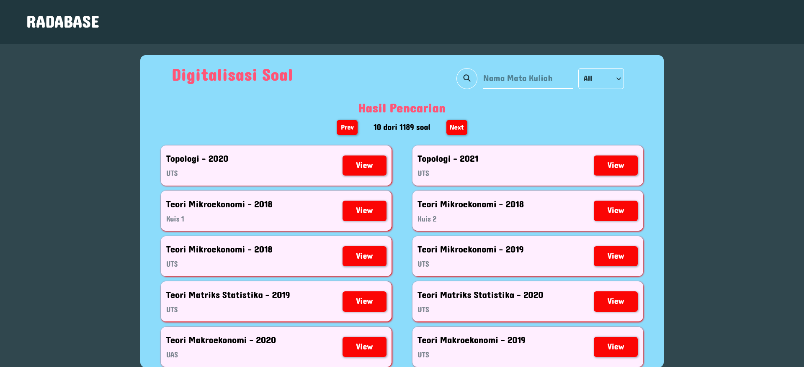

# Personal Project (React JS) - 'RADABASE' A Better Way of Accessing DATABASE RADIAN

A Personal Project to create a User Interface for a database.

## Table of contents

- [Overview](#overview)
  - [Screenshot](#screenshot)
  - [Links](#links)
- [My process](#my-process)
  - [Built with](#built-with)
  - [What I learned](#what-i-learned)
  - [Continued development](#continued-development)
- [Author](#author)
- [Acknowledgments](#acknowledgments)

## Overview

This is a Search Web App to find past exam papers from a database. User's are having difficulties on finding the papers they need directly in the database. This project's goal is to solve that problem.

### Screenshot

### Links

- Submission URL: [Github Repo](https://github.com/fritzadelbertus/PP04-Radabase)
- Live Site URL: [Github Pages](https://fritzadelbertus.github.io/PP04-Radabase/)

## My process

### Built with

- Semantic HTML5 Markup
- Flexbox
- [SASS](https://sass-lang.com/documentation/)
- Mobile First Design
- [Vite + React](https://vitejs.dev/)
- [airbnb](https://github.com/airbnb/javascript) style guide

### What I learned

New Concepts:
- useState and useEffect
- Handling asynchronous requests
- Handling raw data

### Continued development

This project is a one write deploy app. The author is very open for feedback and improvement for the app

## Author

- Website - [Fritz Adelbertus Sitindaon](https://www.furitsu.site)
- LinkedIn - [Fritz Adelbertus](https://www.linkedin.com/in/fritzadelbertus/)

## Acknowledgments

